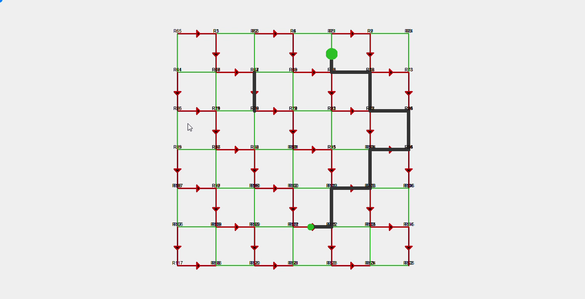
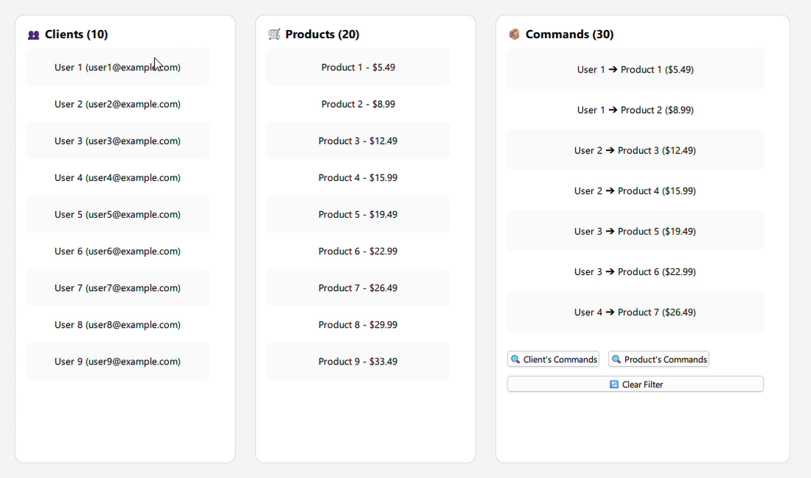

# TModeler

TModeler is a multi-language ORM (Object-Relational Mapping) library that allows managing data models in a simple and efficient way. 
The project is currently available in C++, Java and Python.

## Available Languages

- **C++** : [See C++ documentation](cpp/README.md)
- **Java** : [See Java documentation](java/README.md)
- **Python** : [See Python documentation](python/README.md)

## Features

- **Data model management** : Create, update, delete, and retrieve models.
- **Multithreaded observers** : Allows tracking changes in data across different threads.
- **Filters, joins and aggregations** : Apply complex filters on data, join models and perform aggregations.
- **Model inheritance and custom fields** : Create custom models with inherited or new fields.
- **Geospatial indexing and queries** : Store and search spatial data efficiently (see demo below).
 
---

## Geospatial Demo
The following demo shows the capabilities of **TModeler** in managing complex road networks with one-way constraints, multiple intersections, and dense routing data.

[](https://www.linkedin.com/posts/luc-olivier-fotsing-tambo-a94b00372_qt-qml-c-activity-7347604944583106560-0q3z)

👉 [Watch on LinkedIn](https://www.linkedin.com/posts/luc-olivier-fotsing-tambo-a94b00372_qt-qml-c-activity-7347604944583106560-0q3z)

### Demonstrated Features
1. Nearest road search
Given a random position p, the system retrieves the closest road geometry:

```cpp
auto result = Road::tms.with(r0, g0)
    .lazy()
    .filter(r0.geoobject == g0)
    .filter(g0.geometry.index(p.buffer(b)))
    .order(+g0.geometry.distance(p))
    .build()
    .select<Road>();
```

This query:
- Filters roads whose geometry intersects a buffer area around point p,
- Orders them by ascending distance to p,
- Selects the nearest Road.

2. Route computation
The system can also compute a complete route between two arbitrary positions.
This highlights the routing engine's ability to navigate complex networks with traffic rules.

---

## UI MVVM Demo (Qt/QML)
The following demo shows the capabilities of **TModeler** in building responsive UI with complex routing data using **MVVM** architecture in **Qt/QML**.

👉 [](https://www.linkedin.com/posts/luc-olivier-fotsing-tambo-a94b00372_cplusplus-java-kotlin-activity-7346872422601543680--utC)

---

## Tests

```cpp
class Person : public TModel<Person> {
    TextField name;
    TextField design;
    FloatField ratio;
    BoolField empty;
    TimeField dob = init<TimeField>().format(TF::DATE);
    TimeField update_at = init<TimeField>().format(TF::DATE_TIME);
    ModelField<Person> mother = init<ModelField<Person>>().onDelete(TF::CASCADE);
    ModelField<Familly> familly = init<ModelField<Familly>>().onDelete(TF::CASCADE);
    ListField<Person> friends = init<ListField<Person>>();
};

Person person;
person.id = 100;
person.name = "Lambda";
person.design = "Admin";
person.meta = json;
person.ratio = 0.5;
person.empty = false;
person.dob = "2000-11-07";
person.save();

Tlist<Client, Cmd> join = Client::tms.with<Cmd>(cl, cm)
    .join(JoinType::LEFT).filter(cm.client == cl._id)       // left join: all clients even without orders
    .filter(cm.client == nullptr)                           // keep only clients without orders
    .order(-cl.dob)                                         // sort by date of birth descending (youngest first)
    .group(cl.country)                                      // group clients by country
    .filter(cl._id.count() >= 5);                           // filter countries with at least 5 clients without orders
auto client = join.select<Client>().first();
Log(client.data());
```

This query therefore displays:
- The youngest client (per country),
- among the countries with at least 5 clients who have never placed an order.


# **TModeler** : [See documentation](cpp/README.md)
